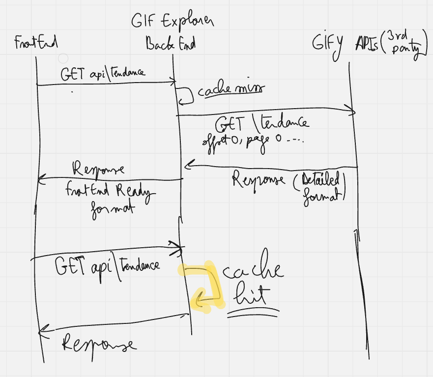

# GIF Explorer

**GIF Explorer** consists of two services:

* **Frontend**: A ReactJS application built and bundled with Vite for near-instant server start, ES module support, and hot reload.
* **Backend**: A NestJS REST API that proxies requests to an external GIF provider, it implements error handling and caching, and returns a consistent JSON payload.

---

## 📖 Sequence Diagram




## 🚀 Getting Started

### Prerequisites

* Docker 20.10+ and Docker Compose
* Node.js 18+ (optional for local dev without Docker)

### Run with Docker

0. add your Giphy api key:

    go to **apps/giphy-service** add a **.env** file with:

   ```GIPHY_API_KEY=<your_api_key_here>```
    
1. build & Start all services:
    
   ```bash
   docker compose up --build
   ```
3. Access the app in your browser: [http://localhost:80](http://localhost:80)

### Run Locally (no Docker)

1. **Backend**

   ```bash
   cd giphy-service
   npm install
   # Create a .env file with:
   # GIPHY_API_KEY=your_api_key_here for example 
   npm run start
   ```
2. **Frontend**

   ```bash
   cd frontend
   npm install
   npm run dev
   ```
3. Open your browser at [http://localhost:5173](http://localhost:5173)

---

## ⚙️ Configuration

Environment variables are loaded from two files:

* **giphy-service/.env** (runtime):

  ```env
  GIPHY_API_KEY=your_api_key_here
  ```
* **frontend/.env** (build time):

  ```env
  VITE_API_URL=http://localhost:3000
  ```

---

## 🛠 Areas for Improvement

* **Frontend Unit Tests**: We currently lack automated tests for React components. Adding Jest and React Testing Library tests will increase confidence during refactoring.
* **Documentation**: Expand code comments and architectural diagrams to meet internal standards and simplify onboarding.

---